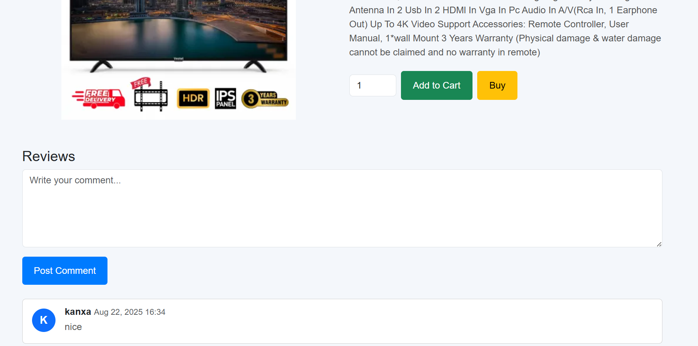

# E-Shop Django Project

**E-Shop** is a full-featured e-commerce web application built with **Django**.It allows users to browse products, view product details, add items to the cart, leave reviews, and manage their profile.The project also includes user authentication and admin functionality to manage products, categories, and tags.

---

## **Features**

- **User Authentication**
  - Register, login, and logout functionality.
  - Secure password handling using Django's authentication system.
  - **Role-based access:** Only superusers can access the admin panel to manage products, categories, and tags.

- **Product Catalog**
  - Browse products with images, price, and description.
  - Filter by categories and tags.
  - Search functionality by product name or description.

- **Product Details**
  - Detailed page showing product information.
  - Related products recommended based on category and tags.
  - Users can post comments/reviews.

- **Shopping Cart**
  - Add products to the cart with desired quantity.
  - Update or remove items from the cart.
  - Display total price dynamically.

- **User Profile**
  - View account information like username and email.
  - Access your cart and orders.

- **Admin Panel**
  - Manage products, categories, and tags.
  - View user activity and manage content easily.

---

## **Tech Stack**

- **Backend:** Python, Django  
- **Frontend:** HTML, CSS, Bootstrap  
- **Database:** PostgreSQL  
- **Authentication:** Django built-in auth system  

---

## **Screenshots**

### Login / Registration
 

### Home Page

### Product Detail

### Cart

